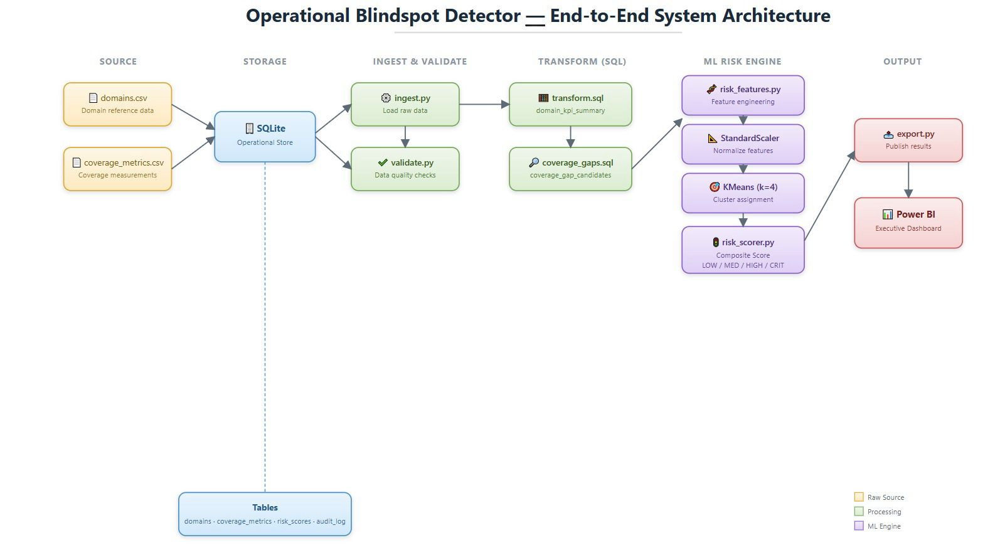
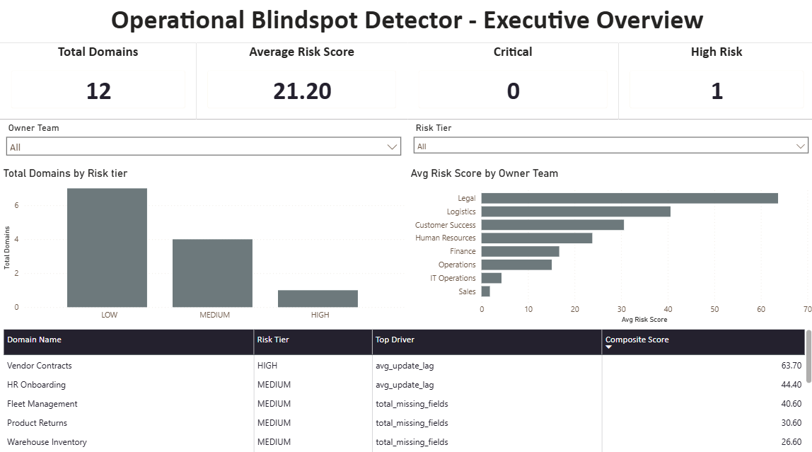
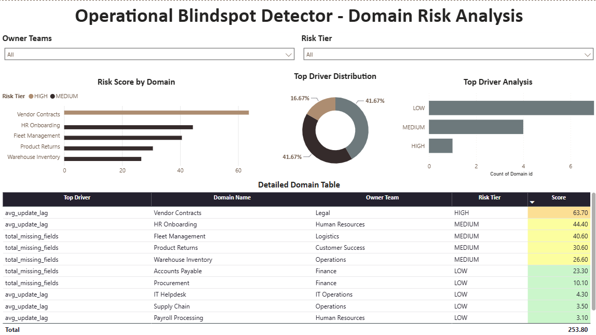
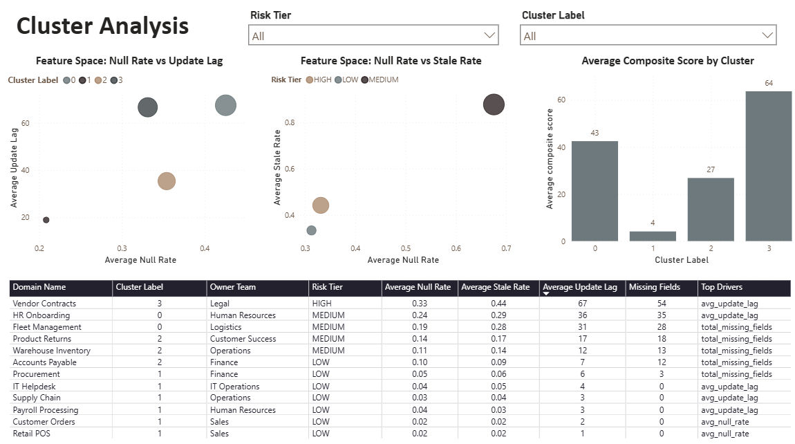
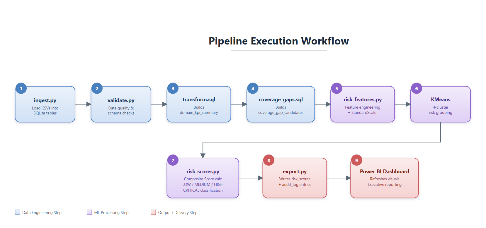
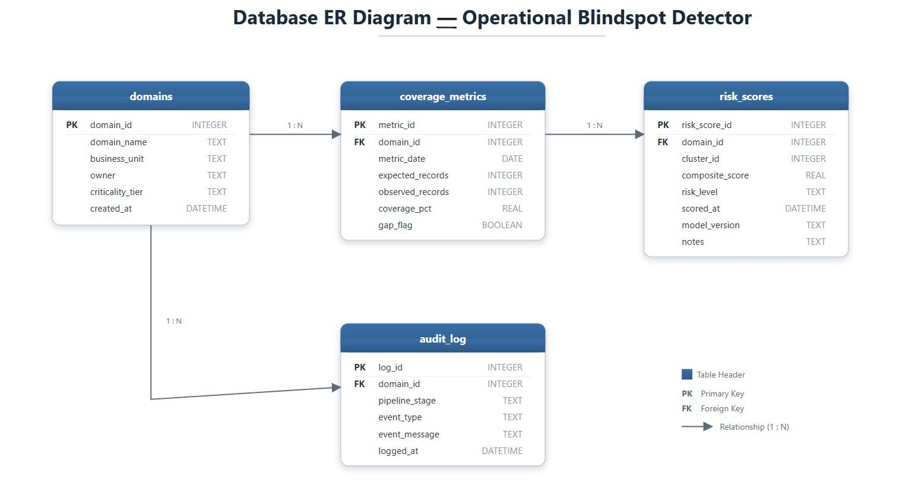

# Operational Blindspot Detector

An end-to-end data analytics and machine learning project that identifies operational blindspots across enterprise business domains by converting raw operational health metrics into actionable risk scores, risk tiers, and executive dashboards.


---

## Executive Summary

Large organizations operate dozens of business domains such as Supply Chain, Finance, Human Resources, Procurement, Legal, Customer Operations, and IT. Each domain continuously generates operational data.

Although data is available, organizations often lack a unified way to identify which business areas are gradually becoming unreliable because of declining data quality, delayed updates, stale information, or missing critical fields.

This project demonstrates an enterprise-style operational risk assessment workflow  that evaluates operational health across multiple business domains.

The pipeline ingests operational metrics, validates data quality, performs SQL-based feature engineering, applies machine learning clustering, calculates a composite operational risk score, and classifies every domain into business risk tiers.

The processed results are delivered through an interactive Power BI dashboard that enables business leaders to identify high-risk operational areas, understand the primary factors contributing to each risk score, and prioritize remediation efforts.

The project demonstrates practical applications of Data Analytics, SQL, Data Engineering, Machine Learning, Python automation, and Business Intelligence within a single end-to-end workflow.

---

# Business Problem

Enterprise systems rarely fail because data is unavailable.

They fail because nobody notices gradual deterioration in operational data quality until it begins affecting business decisions.

Examples include:

- Supply chain inventory not updating on time
- Payroll records containing increasing missing values
- Procurement data becoming stale
- Vendor contracts not being refreshed
- Customer order data gradually losing completeness

These issues usually remain unnoticed because every business team monitors only its own KPIs.

There is no centralized mechanism to continuously measure operational health across all domains and prioritize which business area requires immediate attention.

As organizations grow, manually reviewing hundreds of operational metrics every day becomes impractical.

Business leaders need a system that evaluates operational health, quantifies business risk, and highlights emerging blindspots across business domains.
---

# Solution

Operational Blindspot Detector demonstrates an automated operational risk assessment pipeline for enterprise operational data.

The system combines Data Engineering, SQL transformations, Machine Learning, and Business Intelligence into a single workflow.

The pipeline performs the following steps:

1. Ingest operational datasets into SQLite.
2. Validate schema and data quality.
3. Generate aggregated domain-level features using SQL.
4. Engineer machine learning features from operational KPIs.
5. Standardize feature values.
6. Group similar operational behaviours using K-Means clustering.
7. Calculate a composite operational risk score.
8. Assign business-friendly risk tiers.
9. Identify the dominant factor responsible for each domain's risk.
10. Export results for executive reporting in Power BI.

Instead of requiring business users to interpret multiple operational KPIs individually, the system summarizes overall operational health into a single interpretable risk score supported by detailed root-cause information.

---

# Dashboard Preview

The reporting layer contains three interactive dashboards.

## 1. Executive Overview


Provides a high-level operational summary for business leadership.

Key insights include:

- Total monitored domains
- Average operational risk score
- High-risk domain count
- Risk distribution across business units
- Average risk by owner team
- Highest-risk domains with primary risk drivers

---

## 2. Domain Risk Analysis



Provides detailed investigation capabilities for operational teams.

Key insights include:

- Domain-wise composite risk scores
- Distribution of dominant risk drivers
- Risk tier analysis
- Interactive filtering by owner team
- Conditional formatting based on calculated operational risk

---

## 3. Machine Learning Cluster Analysis



Visualizes how KMeans clustering groups domains based on operational behaviour.

Key insights include:

- Feature space visualization
- Cluster assignments
- Average composite score by cluster
- Operational similarity between domains
- Relationship between engineered features and business risk

---

# System Architecture


The project follows a modular analytics engineering architecture where each stage performs a single responsibility. Every component consumes the output of the previous stage and produces a standardized output for the next stage, making the pipeline modular, reusable, and easy to maintain.

- **Data Source:** `domains.csv` and `coverage_metrics.csv` provide operational domain metadata and daily operational health metrics.

- **Data Ingestion:** `ingest.py` loads the raw datasets into SQLite and records pipeline activity.

- **Data Validation:** `validate.py` performs schema validation, duplicate detection, null checks, numeric range validation, and referential integrity checks.

- **Data Transformation:** `transform.sql` and `coverage_gaps.sql` aggregate operational KPIs and identify domains that breach predefined operational thresholds.

- **Feature Engineering:** `risk_features.py` generates the feature matrix required for machine learning.

- **Machine Learning:** `cluster_model.py` standardizes the engineered features and groups similar business domains using KMeans clustering.

- **Risk Assessment:** `risk_scorer.py` calculates composite operational risk scores, assigns business-friendly risk tiers, and identifies the primary factor contributing to each domain's risk.

- **Reporting:** `export.py` prepares reporting datasets that are visualized through interactive Power BI dashboards.
---

# Pipeline Execution



The pipeline is executed through `run_pipeline.py`, which orchestrates every stage in sequence.

1. **Data Ingestion (`ingest.py`)**  
   Loads the raw operational datasets into SQLite and populates the required database tables.

2. **Data Validation (`validate.py`)**  
   Performs schema validation, duplicate detection, null checks, numeric range validation, referential integrity checks, and records execution details in the audit log.

3. **SQL Transformation (`transform.sql`)**  
   Creates the `domain_kpi_summary` view by aggregating operational KPIs at the business domain level.

4. **Coverage Gap Detection (`coverage_gaps.sql`)**  
   Creates the `coverage_gap_candidates` view to identify domains that exceed predefined operational thresholds.

5. **Feature Engineering (`risk_features.py`)**  
   Generates the feature matrix required for machine learning from the aggregated operational KPIs.

6. **Machine Learning (`cluster_model.py`)**  
   Standardizes the engineered features, applies KMeans clustering, and assigns each business domain to a cluster.

7. **Risk Assessment (`risk_scorer.py`)**  
   Calculates composite operational risk scores, assigns business-friendly risk tiers, and identifies the primary risk driver for each domain.

8. **Reporting (`export.py`)**  
   Exports the processed datasets in a format ready for visualization in Power BI.
---

# Database Design



SQLite is used as the operational database for storing, processing, and managing the project's data throughout the pipeline.

The database consists of four core tables:

- **domains** stores metadata for each monitored business domain, including the domain name, owner team, and data source.

- **coverage_metrics** stores daily operational health metrics for every business domain, such as total records, null rate, stale rate, update lag, and missing fields.

- **risk_scores** stores the calculated composite risk scores, assigned cluster labels, business-friendly risk tiers, and the primary risk driver for each domain.

- **audit_log** records the execution history of every pipeline stage, including validation results, execution status, affected rows, and diagnostic messages.

The relationships between these tables enable the pipeline to track operational metrics, generate risk assessments, and maintain an audit trail for every execution.
Primary relationships:

- One domain can have multiple daily operational metric records.
- One domain can have multiple historical risk assessments.
- Every pipeline execution records its status in the audit log.

---

# Machine Learning Approach

The project uses **unsupervised learning** because no predefined labels exist to classify operational health.

Instead of manually defining which domains are healthy or risky, the model groups domains with similar operational behaviour using KMeans clustering.

### Model Configuration

The machine learning model is configured with the following parameters:

- **Algorithm:** KMeans Clustering is used to group business domains with similar operational characteristics.

- **Number of Clusters:** 4 clusters are created to represent different operational risk patterns.

- **Feature Scaling:** StandardScaler standardizes all numerical features before clustering to ensure equal contribution during distance calculations.

- **Random State:** A fixed value of **42** is used to produce reproducible clustering results across multiple executions.

- **Initialization:** The model uses **`n_init = 20`**, performing 20 different initializations and selecting the best clustering solution based on the lowest inertia.
### Input Features

The clustering model is trained using four engineered operational quality indicators.

- **`avg_null_rate`** represents the average percentage of missing (null) values across the observation period.

- **`avg_stale_rate`** represents the average percentage of stale or outdated records.

- **`avg_update_lag`** represents the average delay, in hours, between the latest available data and the expected refresh time.

- **`total_missing_fields`** represents the total number of expected data fields that were missing across the observation period.

Together, these features capture different aspects of operational data quality and form the input feature set for the KMeans clustering model.
### Processing Workflow

1. Aggregate operational KPIs using SQL.
2. Handle missing values using median imputation.
3. Standardize numerical features.
4. Train the KMeans clustering model.
5. Assign every domain to a cluster.
6. Convert clusters into business-friendly operational risk tiers.

The clustering model enables domains with similar operational behaviour to be analysed together rather than evaluated using isolated KPIs.

---

# Risk Scoring Methodology

Machine learning identifies similar operational patterns, but business users require a single interpretable measure of overall operational health.

To address this, the project calculates a composite operational risk score ranging from **0 to 100**.

The score combines four operational quality indicators:

- Average Null Rate
- Average Stale Rate
- Average Update Lag
- Total Missing Fields

Each indicator contributes according to predefined business weights.

Based on the calculated composite score, each business domain is assigned to one of four operational risk tiers:

- **LOW (0 to 25):** The domain exhibits healthy operational data quality with minimal risk indicators.

- **MEDIUM (26 to 50):** The domain shows moderate operational issues that should be monitored and investigated.

- **HIGH (51 to 75):** The domain demonstrates significant data quality concerns requiring timely corrective action.

- **CRITICAL (76 to 100):** The domain exhibits severe operational issues that require immediate attention to prevent potential business impact.

These risk tiers simplify interpretation of the composite score and help prioritize remediation efforts across business domains.

In addition to the numerical score, the system identifies the **Top Driver**, highlighting the operational metric that contributed most to the final risk score. This enables business teams to focus on the primary cause rather than analysing every KPI individually.

> **Note:** The current synthetic dataset does not produce any domains in the CRITICAL tier. The scoring framework supports all four tiers and assigns CRITICAL when future datasets exceed the configured thresholds.

---

# Technology Stack

The project was developed using the following technologies:

- **Programming Language:** Python 3 is used to build the end-to-end analytics pipeline.

- **Database:** SQLite serves as the operational database for storing raw, processed, and scored data.

- **SQL:** SQLite SQL and SQL Views are used to aggregate operational KPIs and transform raw metrics into analysis-ready datasets.

- **Data Processing:** Pandas and NumPy are used for data ingestion, cleaning, transformation, and feature engineering.

- **Machine Learning:** Scikit-learn is used for feature standardization with StandardScaler and unsupervised clustering using KMeans.

- **Business Intelligence:** Microsoft Power BI and DAX are used to build interactive dashboards and visualize operational risk insights.

- **Development Tools:** Visual Studio Code is used for development, DBeaver for database management, and Git for version control.
---

# Project Features

- End-to-end analytics pipeline
- Modular pipeline architecture
- Automated data ingestion
- Data quality validation
- SQL-based KPI aggregation
- Feature engineering for machine learning
- KMeans clustering for operational segmentation
- Composite operational risk scoring
- Business-friendly risk classification
- Root cause identification using Top Driver analysis
- Interactive Power BI dashboards
- Pipeline audit logging
- Re-runnable execution workflow

---

# Project Structure

```text
operational_blindspot_detector/
│
├── data/
│   ├── raw/
│   │   ├── domains.csv
│   │   └── coverage_metrics.csv
│   ├── processed/
│   │   ├── risk_features.csv
│   │   ├── risk_features_raw.csv
│   │   └── clustered_risk_features.csv
│   └── exports/
│       └── risk_scores.csv
│
├── db/
│   ├── blindspot.db
│   └── schema.sql
│
├── sql/
│   ├── transform.sql
│   └── coverage_gaps.sql
│
├── src/
│   ├── ingest.py
│   ├── validate.py
│   ├── risk_features.py
│   ├── cluster_model.py
│   ├── risk_scorer.py
│   └── export.py
│
├── notebooks/
│   └── eda_and_scoring.ipynb
│
├── powerbi/
│   └── blindspot_report.pbix
│
├── config.yaml
├── run_pipeline.py
└── README.md
```

---

# Dataset

The project uses a realistic synthetic enterprise dataset that simulates operational data quality monitoring across multiple business domains.

The dataset consists of:

- **12 Business Domains** representing different functional areas within an enterprise.
- **7-Day Observation Period** to capture short-term operational trends.
- **84 Daily Operational Snapshots** (12 domains × 7 days) used for analysis and machine learning.
- **SQLite Database** for storing, transforming, and managing the operational data throughout the pipeline.
- **3 Interactive Power BI Dashboard Pages** for visualizing operational health, risk analysis, and machine learning insights.


The operational dataset captures the following metrics for each business domain:

- **Total Records:** The total number of records available for the business domain on a given snapshot date.

- **Null Rate:** The percentage of missing (null) values present in the dataset.

- **Stale Rate:** The percentage of records that have become outdated or have not been refreshed within the expected timeframe.

- **Update Lag:** The average delay, measured in hours, between the expected and actual data refresh time.

- **Missing Fields:** The number of expected data fields that were absent from the dataset during ingestion.

The dataset intentionally contains healthy, degrading, chronically poor, and high-risk operational patterns to demonstrate the complete analytics workflow.

---

# Dashboard Overview

## Executive Overview

Provides an organization-wide view of operational health.

Highlights:

- Overall risk distribution
- Average operational risk score
- Highest-risk business domains
- Risk distribution by owner team
- Top operational blindspots

---

## Domain Risk Analysis

Supports operational investigation at the domain level.

Highlights:

- Composite risk score comparison
- Risk tier analysis
- Primary operational risk driver
- KPI comparison
- Domain ranking
- Interactive filtering

---

## Machine Learning Cluster Analysis

Demonstrates how KMeans groups domains exhibiting similar operational behaviour.

Highlights:

- Cluster assignments
- Feature-space visualization
- Cluster-level risk comparison
- Operational similarity analysis
- Cluster score distribution

---

# Results

The completed pipeline successfully demonstrates an end-to-end analytics engineering workflow.

The pipeline performs : 
- Loads operational datasets into SQLite.
- Validates incoming operational data.
- Aggregates KPIs using SQL views.
- Engineers analytical features.
- Groups operational domains using machine learning.
- Calculates composite operational risk scores.
- Identifies the primary driver behind each score.
- Produces Power BI-ready reporting datasets.
- Visualizes operational health through interactive dashboards.

The modular architecture allows every stage to execute independently while remaining fully integrated within a single automated pipeline.


# Future Enhancements

The current implementation demonstrates a complete analytics engineering workflow using a realistic synthetic enterprise dataset. The architecture is modular and can be extended with additional capabilities.

Planned enhancements include:

- Automated Data Quality Profiler to generate operational KPIs directly from raw datasets.
- Historical risk trend analysis across multiple pipeline executions.
- Incremental pipeline execution for scheduled monitoring.
- Enterprise data source integration (ERP, CRM, APIs, Data Warehouse).
- Automated notifications for high-risk operational domains.
- Cloud deployment and scheduled execution.

---

# How to Run

## Clone the Repository

```bash
git clone https://github.com/<username>/operational_blindspot_detector.git
cd operational_blindspot_detector
```

---

## Install Dependencies

```bash
pip install pandas numpy scikit-learn pyyaml
```

---

## Execute the Pipeline

```bash
python run_pipeline.py
```

The pipeline executes the following stages sequentially:

1. Data Ingestion
2. Data Validation
3. SQL Transformation
4. Feature Engineering
5. Machine Learning Clustering
6. Composite Risk Scoring
7. Dataset Export

---

## View the Dashboard

Open the Power BI report located at:

```text
powerbi/operational_blindspot_detector_result.pbix
```

Refresh the data source if required.

---

# Author

**Tejal Kunjir**

---